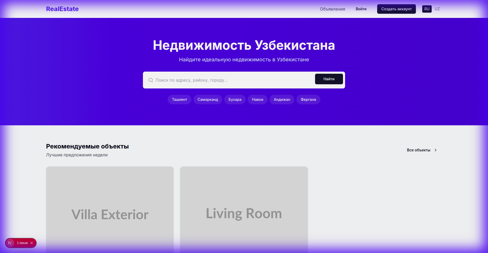
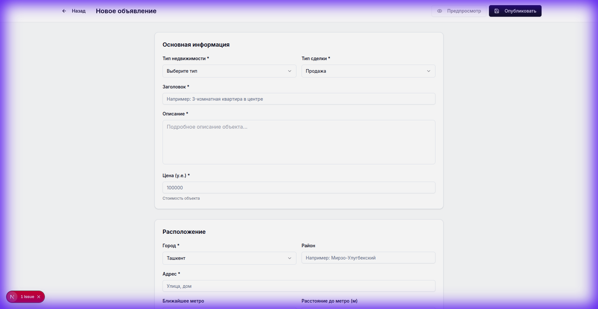
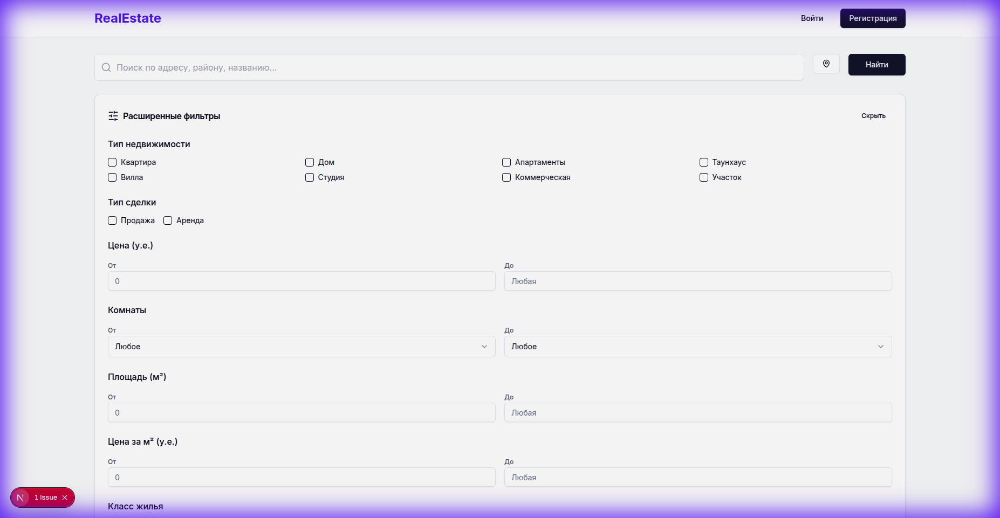

# Application Verification Walkthrough

## Overview
I performed a browser-based smoke test to verify the application's current state and confirm the findings from the code audit. The application successfully compiles and runs, but the "Add Property" flow exhibits the expected gaps.

## Test Run Details
- **Environment**: Development Server (`pnpm dev`)
- **URL**: `http://localhost:3000`
- **Date**: 2025-12-06
- **Result**: **Passed with Issues** (App runs, but features missing)

## 1. Homepage Load
- **Action**: Navigated to `http://localhost:3000`
- **Observation**: Homepage loads correctly. Search bar and main layout are visible.
- **Screenshot**:

## 2. "Add Property" Flow Verification
- **Action**: Navigated to `/properties/new`.
- **Goal**: Verify presence of "Currency Toggle" and "Mahalla" location field.
- **Observation**:
    - **Price Field**: Labeled "Цена (у.е.)". **No currency toggle** (USD/UZS) is present.
    - **Location**: Fields for "City" and "District" are present. **No "Mahalla" field** is visible.
- **Screenshot**:

## 3. Search Functionality Verification
- **Action**: Searched for "Ташкент" and opened "Advanced Filters".
- **Goal**: Verify if search works and if currency can be selected in filters.
- **Observation**:
    - **Search**: Works, results update properly.
    - **Filters**: Price filter range is available but **lacks Currency Toggle**. It assumes "y.e." (conditional units) without an option to switch to UZS.
- **Screenshot**:

## 4. Conclusion
The browser test confirms the code audit findings. The application is functional but implementation of the "Inventory Engine" features (Phase 1) is incomplete regarding strict local requirements (Currency, Mahalla).
